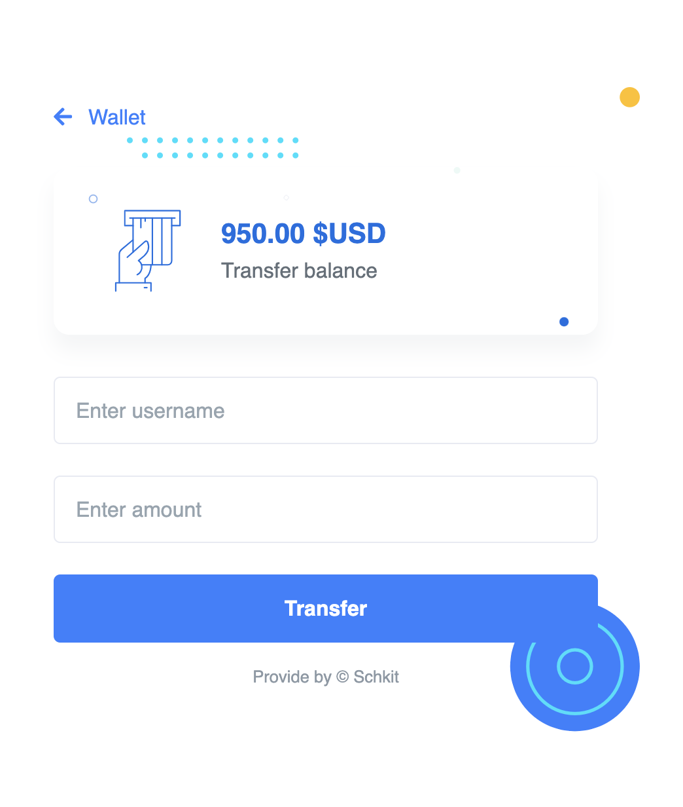

# SchkitPay


SchkitPay is a digital wallet application built with Python and Django. Users can link a payment gateway, such as their bank card, to their wallet. They can top up their wallet from their bank card, withdraw funds back to their bank, and send money from one account to another. The application includes features such as user authentication, wallet app, friend request systems, and email verification.

## Table of Contents

- [Features](#features)
- [Installation](#installation)

## Features

- **User Authentication**: Secure user registration and login system.
- **Wallet App**: Manage your digital wallet with ease.
- **Link Payment Gateway**: Link your bank card to your wallet.
- **Top Up**: Top up your wallet from your bank card.
- **Withdraw**: Withdraw funds from your wallet back to your bank.
- **Send Money**: Send money from one account to another.
- **Friend Request System**: Connect with friends and manage friend requests.
- **Email Verification**: Ensure the security of your account with email verification.

## Screenshots





## Installation

Follow these steps to get the project up and running on your local machine.

1. **Clone the repository:**
    ```sh
    git clone https://github.com/Mitchell-Travis/schkitpay.git
    cd schkitpay
    ```

2. **Install dependencies:**
    ```sh
    pip install -r requirements.txt
    ```

3. **Run migrations:**
    ```sh
    python manage.py migrate
    ```

4. **Start the development server:**
    ```sh
    python manage.py runserver
    ```

5. **Access the application:**
    Open your web browser and navigate to [http://localhost:8000/](http://localhost:8000/)
